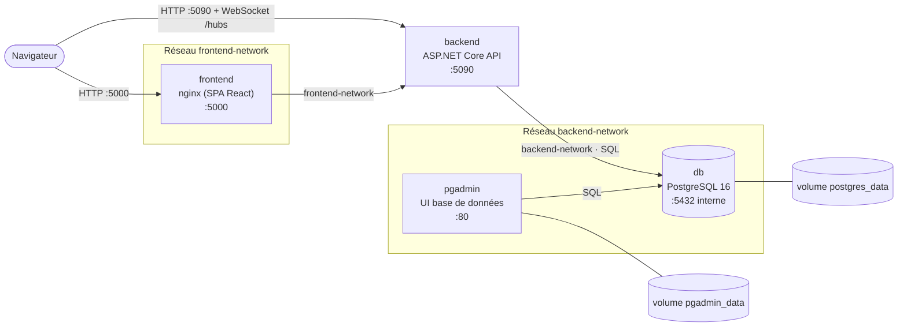

# Architecture du projet

RedPandaFlow est découpé en quatre services conteneurisés, orchestrés par un
unique fichier `docker-compose.yml` (dépôt `redpandaflow-infra`).

## Schéma d'architecture



> Le `backend` est sur **les deux réseaux** (il fait le pont présentation ↔ données) ;
> il est représenté hors des cadres pour cette raison.

## Services et rôles

| Service    | Image                                      | Rôle                                                           |
| ---------- | ------------------------------------------ | -------------------------------------------------------------- |
| `frontend` | `nginxinc/nginx-unprivileged` (build node) | Sert l'application React (SPA) compilée en statique            |
| `backend`  | `.NET 10` (build SDK → runtime aspnet)     | API REST + hubs SignalR (temps réel)                           |
| `db`       | `postgres:16-alpine`                       | Base de données relationnelle, persistée sur volume            |
| `pgadmin`  | `dpage/pgadmin4`                           | Interface d'administration de la base (service supplémentaire) |

## Communication entre services

- Le **navigateur** charge la SPA servie par `frontend` (nginx) sur le port `5000`.
- La SPA appelle l'**API** `backend` sur le port `5090` : requêtes REST
  (authentification, espaces, tableaux, cartes…) et connexions **WebSocket**
  vers les hubs SignalR (`/hubs/board`, `/hubs/notifications`) pour le temps réel.
- Le `backend` se connecte à la base `db` via le nom de service `db` sur le
  réseau interne (`Host=db;Port=5432`). La base **n'est pas exposée** à l'hôte.
- `pgadmin` accède à `db` sur le même réseau interne.

## Segmentation réseau

Deux réseaux Docker distincts isolent les responsabilités :

- **`frontend-network`** : relie `frontend` et `backend`.
- **`backend-network`** : relie `backend`, `db` et `pgadmin`.

Le `backend` est le seul service présent sur les deux réseaux : il fait le pont
entre la couche présentation et la couche données. La base de données n'est
joignable que sur `backend-network`, jamais depuis le `frontend` ni depuis l'hôte.

## Démarrage de la stack

Le `backend` dépend de la santé de la base (`depends_on: condition:
service_healthy`) : il n'est lancé qu'une fois que le healthcheck PostgreSQL
(`pg_isready`) est au vert, ce qui évite les erreurs de connexion au démarrage.

```bash
docker compose up -d --build
```
